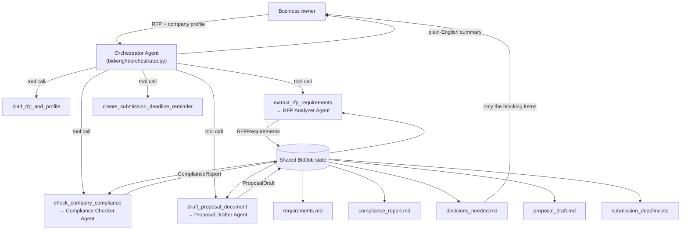

# BidWright

**An AI agent that takes a small business from "here's an RFP" to "here's a compliant, tailored proposal draft and a short list of what you still need to decide."**

Built with the [Strands Agents SDK](https://strandsagents.com) for the Agents for Humans Hackathon — **Professional Agents** track.

## The problem

Small contractors and service businesses (landscapers, IT shops, cleaning
companies, consultants) lose bids they were qualified to win because RFPs are
dense, repetitive, and easy to get wrong on a technicality: a missing
certificate, an insurance minimum that's $1 short, a page limit nobody
noticed. Reading a 10-page solicitation, cross-checking every requirement
against your own paperwork, and writing a tailored proposal is hours of
judgment-adjacent busywork that eats the time an owner should be spending
running the business — or bidding on the *next* contract.

BidWright is that first pass. It reads the RFP, checks your company against
every mandatory requirement, drafts the proposal itself, puts the deadline on
your calendar, and only asks you to decide the things only you can decide:
*is this gap worth fixing, and are we bidding at all?*

## Who it's for

Small business owners and office managers who respond to RFPs/bids
regularly — municipal contractors, landscapers, janitorial and facilities
companies, IT/managed-service providers, construction subs — and don't have a
dedicated proposal/compliance team.

## What it does, end to end

Given an RFP document and a company capability profile, BidWright:

1. **Reads** the RFP (PDF, DOCX, Markdown, or plain text) and the company profile.
2. **Extracts** a structured requirements record: deadline, submission method,
   required certifications/licenses, minimum insurance, eligibility criteria,
   evaluation criteria, format rules, and a full submission checklist.
3. **Checks compliance**: for every requirement, decides `met`, `gap`, or
   `needs_review`, with a severity (`blocking` vs `warning`) and a concrete
   recommendation for closing each gap. It never claims something is met
   unless the company profile actually backs it up.
4. **Creates a calendar reminder** (`.ics`) for the submission deadline, with
   automatic 3-day and 1-day advance reminders.
5. **Drafts the proposal**: cover letter, executive summary, technical
   approach, qualifications, and a compliance matrix — honestly flagging open
   gaps instead of papering over them. Pricing is left to the owner; the
   agent never invents numbers.
6. **Surfaces exactly one decision-ready summary** (`decisions_needed.md`):
   ready to submit, or here are the *N* blocking gaps and what to do about
   each one. Everything else runs unattended.

Try it against the included example (a municipal landscaping RFP with a
deliberately underinsured example company, so the compliance check has
something real to catch) — see **Quickstart** below.

## Architecture

BidWright is a Strands **"agents as tools"** multi-agent system: an
orchestrator agent decides what to do next, and each pipeline stage is
itself a full Strands `Agent` call with its own system prompt and a typed
[Pydantic structured output](https://strandsagents.com), wrapped as a tool.



Design choices worth calling out:

- **Structured contracts, not free text between agents.** Each sub-agent
  returns a validated Pydantic model (`RFPRequirements`, `ComplianceReport`,
  `ProposalDraft`) via Strands' `structured_output_model=`. The orchestrator
  LLM only sees short natural-language tool summaries — the documents written
  to disk always come straight from the validated data, so a chatty
  orchestrator can never corrupt the numbers it's reporting on.
- **The "only interrupt for real decisions" file is generated by code, not
  the model.** `decisions_needed.md` is built deterministically from the
  `ComplianceReport` in `bidwright/rendering.py`, so that guarantee doesn't
  depend on the orchestrator remembering to keep its promise.
- **Model-provider agnostic.** `bidwright/config.py` picks Anthropic's API
  directly (for local/dev, an `ANTHROPIC_API_KEY`) or Amazon Bedrock
  (no key, just AWS credentials — the path AgentCore deployments use)
  automatically, and every agent in the system shares that one decision.

## Quickstart

```bash
python3 -m venv .venv && source .venv/bin/activate
pip install -e ".[ui]"
cp .env.example .env   # then fill in ANTHROPIC_API_KEY (or configure AWS creds for Bedrock)
```

Run the CLI against the included example RFP and company profile:

```bash
bidwright run --rfp examples/sample_rfp.md --profile examples/company_profile.json --out output
```

This streams each tool call as it happens, then prints a summary and writes
`requirements.md`, `compliance_report.md`, `decisions_needed.md`,
`proposal_draft.md`, and `submission_deadline.ics` to `output/`.

Or run the Streamlit demo:

```bash
streamlit run app_streamlit.py
```

Pick the bundled example (or upload your own RFP + company profile) and click
**Run BidWright** — it shows a live agent activity log, the decision summary,
and downloadable drafts.

Check which model provider will be used at any time with `bidwright status`.

## Project layout

```
bidwright/
  models.py                 Pydantic schemas shared between all agents
  config.py                 Model provider selection (Anthropic direct / Bedrock)
  rendering.py               Deterministic Markdown rendering (no LLM calls)
  tools/
    documents.py             @tool read_document, save_text_file
    calendar.py               @tool create_deadline_reminder (.ics generation)
  agents/
    rfp_analyzer.py           Sub-agent: RFP text -> RFPRequirements
    compliance_checker.py     Sub-agent: RFPRequirements + profile -> ComplianceReport
    proposal_drafter.py       Sub-agent: -> ProposalDraft
  orchestrator.py             Orchestrator Agent (agents-as-tools) + shared BidJob state
  pipeline.py                 run_bid_job() convenience wrapper used by CLI/UI/AgentCore
  cli.py                      `bidwright run` / `bidwright status`
app_streamlit.py             Demo UI
agentcore_app.py             Optional Bedrock AgentCore Runtime entrypoint
examples/                    Sample RFP + company profile (with a deliberate insurance gap)
tests/                       Unit tests (no network) + an opt-in live-model integration test
deploy/                       Dockerfile + AgentCore deployment notes
```

## Testing

```bash
pip install -e ".[dev]"
pytest
```

All unit tests run offline against the tool functions, Pydantic models, and
Markdown rendering — no API key required. A live end-to-end test against a
real model is included but skipped by default; opt in with:

```bash
BIDWRIGHT_RUN_INTEGRATION=1 pytest tests/test_pipeline_integration.py
```

## Deploying to Amazon Bedrock AgentCore (optional)

`agentcore_app.py` wraps the exact same `run_bid_job` pipeline behind a
`BedrockAgentCoreApp` entrypoint for a managed, autoscaled deployment. See
[`deploy/README.md`](deploy/README.md) for the container/CLI steps. This is a
stretch goal, not a requirement — everything above runs standalone.

## Honest limitations

- BidWright drafts; it does not submit. A human always reviews and signs off —
  that's the point of `decisions_needed.md`.
- Extraction quality depends on the RFP's own clarity. Ambiguous or
  poorly-scanned source documents should be spot-checked against
  `requirements.md`.
- This is not legal advice. For contracts with real regulatory teeth, have
  counsel review before submission — BidWright is built to make that review
  fast, not to replace it.
