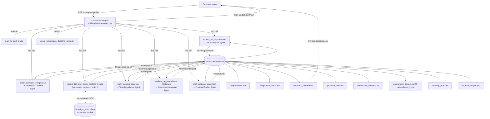

# BidWright

**An AI agent that takes a small business from "here's an RFP" to "here's a compliant, tailored proposal draft and a short list of what you still need to decide."**

Built with the [Strands Agents SDK](https://strandsagents.com) for the Agents for Humans Hackathon — **Professional Agents** track.

## The problem

Small contractors and service businesses (landscapers, IT shops, cleaning
companies, consultants) lose bids they were qualified to win because RFPs are
dense, repetitive, and easy to get wrong on a technicality: a missing
certificate, an insurance minimum that's $1 short, a page limit nobody
noticed. Reading a 10-page solicitation, cross-checking every requirement
against your own paperwork, and writing a tailored proposal is hours of
judgment-adjacent busywork that eats the time an owner should be spending
running the business — or bidding on the *next* contract.

BidWright is that first pass. It reads the RFP, checks your company against
every mandatory requirement, drafts the proposal itself, puts the deadline on
your calendar, and only asks you to decide the things only you can decide:
*is this gap worth fixing, and are we bidding at all?*

## Who it's for

Small business owners and office managers who respond to RFPs/bids
regularly — municipal contractors, landscapers, janitorial and facilities
companies, IT/managed-service providers, construction subs — and don't have a
dedicated proposal/compliance team.

## What it does, end to end

Given an RFP document and a company capability profile, BidWright:

1. **Reads** the RFP (PDF, DOCX, Markdown, or plain text) and the company profile.
2. **Extracts** a structured requirements record: deadline, submission method,
   required certifications/licenses, minimum insurance, eligibility criteria,
   evaluation criteria, format rules, and a full submission checklist.
3. **Checks compliance**: for every requirement, decides `met`, `gap`, or
   `needs_review`, with a severity (`blocking` vs `warning`) and a concrete
   recommendation for closing each gap. It never claims something is met
   unless the company profile actually backs it up.
4. **Creates a calendar reminder** (`.ics`) for the submission deadline, with
   automatic 3-day and 1-day advance reminders.
5. **Drafts the proposal**: cover letter, executive summary, technical
   approach, qualifications, and a compliance matrix — honestly flagging open
   gaps instead of papering over them. Pricing is left to the owner; the
   agent never invents numbers.
6. **Surfaces exactly one decision-ready summary** (`decisions_needed.md`):
   ready to submit, or here are the *N* blocking gaps and what to do about
   each one. Everything else runs unattended.

Try it against the included example (a municipal landscaping RFP with a
deliberately underinsured example company, so the compliance check has
something real to catch) — see **Quickstart** below.

## Teaming partner gap-fill advisor

A small business frequently can't meet every RFP requirement alone — a
missing certification, insufficient bonding or insurance capacity, no past
performance in the specific NAICS code, no clearance — and the common outcome
isn't teaming with a subcontractor or joint-venture partner who could fill
exactly that gap, it's simply losing the bid. Owners without a contracts team
rarely have the time to figure out what to search for or how to make the
pitch, so bids that were genuinely winnable get abandoned instead.

Right after the compliance check, BidWright looks at every gap it found and,
for each one that's plausibly fillable by bringing in an outside partner (as
opposed to a gap the company can just fix itself this week, like raising an
insurance limit), writes a recommendation to `teaming_plan.md`:

- The specific capability a partner would need to bring.
- Concrete, actionable search guidance — SAM.gov's Subcontracting Network
  (SubNet), the awarding agency's small business liaison, a local PTAC/APEX
  Accelerator, or a named trade association for the trade or NAICS code —
  never a vague "find a partner."
- A ready-to-send draft outreach email pitching the specific arrangement.
- A teaming risk to verify: many solicitations cap the percentage of work
  that may be subcontracted, or require the prime to self-perform a minimum
  percentage — BidWright flags this as something to check against the RFP's
  actual limit rather than guessing one.

BidWright never invents a specific company as a prospective partner — it has
no partner directory, so it gives search guidance, not fabricated leads — and
it never claims a gap is fillable by teaming when it plainly isn't (a
security clearance the RFP requires the *prime* itself to hold, for example,
can't be borrowed from a subcontractor). If none of the gaps found are
teaming-fillable, or there were no gaps at all, `teaming_plan.md` still gets
written and says so plainly instead of being skipped or padded with filler.
When a teaming plan does have recommendations, the drafted proposal's open
questions point to it, so the decision to team never gets buried in a
different file than the rest of what needs the owner's attention.

## Amendment / addendum impact analysis

Government and commercial RFPs routinely get amended after they're first
posted — a deadline pushed back a week, a requirement added or dropped, a
clarifying Q&A response, an attachment swapped out. Agencies and buyers
publish these amendments on the same portal as the original RFP, but a small
business without a dedicated contracts team watching that portal every day
frequently never sees them — and ends up submitting a compliant proposal
against a *stale* version of the requirements, which is exactly the kind of
technicality that gets a bid thrown out or leaves money on the table.

If you have an amendment/addendum document for an RFP, pass it with
`--amendment`:

```bash
bidwright run --rfp examples/sample_rfp.md --profile examples/company_profile.json \
  --amendment path/to/amendment_1.pdf --out output
```

BidWright diffs the amendment against the already-extracted requirements (and
the compliance report, if one exists) and reports, in `amendment_impact.md`:

- A plain-language summary of what actually changed, with an urgency rating
  (`blocking` / `warning` / `info`).
- Whether the submission deadline moved, and to what.
- Exactly what's new, removed, or modified — not just "insurance changed" but
  the specific requirement, what it used to say, and what it says now.
- Whether the amendment invalidates anything a prior compliance check marked
  "met," or changes a gap it had already flagged.
- Which sections of an already-drafted proposal, if any, are now stale and
  need rework.
- A concrete recommendation for a busy owner.

If the amendment is significant, that same information also gets appended as
a clearly flagged **"AMENDMENT ALERT"** section at the top of
`decisions_needed.md`, so it can't get buried under an old compliance report
someone already skimmed. A trivial amendment (e.g. a typo fix) is recorded in
`amendment_impact.md` but does not clutter `decisions_needed.md` with an
alert — the goal is to interrupt the owner for things that actually need a
decision, same as the compliance gaps.

`--amendment` is entirely optional. Omit it and BidWright behaves exactly as
it always has — this is additive, not a required step, because most RFPs
never get amended.

## Portfolio Insights: cross-bid institutional memory

Small businesses that run BidWright — or just bid generally — don't bid
once; they bid repeatedly, RFP after RFP, over years. But every run today is
stateless: nobody notices that the same compliance gap ("insufficient
bonding capacity," "missing a specific certification") keeps recurring
across bid after bid, quietly costing the company wins, because nothing
persists across runs to notice the pattern. A single bid's compliance report
genuinely can't see that — it only has this one RFP in front of it.

Right after the compliance check, BidWright records this bid's outcome
(project identity, overall status, and each gap's requirement description +
severity — not the full gap detail) to a small persistent JSON file, and
scans recent history for gap requirements that have shown up on at least 2
of the company's last 5 recorded bids. The result is written to
`portfolio_insights.md`:

- How many bids are on record and how many of the recent ones were scanned.
- Every recurring gap: which requirement, its most recent severity, how many
  of the recent bids it appeared on, and the first and most recent RFP it
  showed up on.

This is deterministic, pure-code pattern-matching over structured records —
never an LLM guessing at a pattern — and it's additive: it runs on every bid
automatically, using `bidwright_history.json` in the current directory by
default. Point every run for the same company at the same file with
`--history-file` if you want it somewhere else, or to keep separate history
per company/division:

```bash
bidwright run --rfp examples/sample_rfp.md --profile examples/company_profile.json \
  --history-file ~/bidwright/acme_landscaping_history.json --out output
```

On the very first bid BidWright ever records for a company,
`portfolio_insights.md` says so plainly — "not enough bid history yet" — it
is never treated as an error, and no recurrence is ever fabricated to fill
the file. Missing or corrupted history files are treated the same way: a
fresh start, not a crash — this run's data still gets recorded going
forward.

**Honest limitation:** recurrence detection is exact-text matching on the
gap requirement description, not semantic. "Insufficient bonding capacity"
and "bonding capacity too low" describe the same real problem but won't be
counted as the same recurring gap without a normalization step this feature
deliberately doesn't attempt — a simple, predictable rule that's upfront
about what it misses beats a fuzzy matcher whose behavior nobody could
reliably predict. If this turns out to matter in practice, that
normalization step belongs in `bidwright/tools/history.py`, isolated from
everything else.

## Architecture

BidWright is a Strands **"agents as tools"** multi-agent system: an
orchestrator agent decides what to do next, and each pipeline stage is
itself a full Strands `Agent` call with its own system prompt and a typed
[Pydantic structured output](https://strandsagents.com), wrapped as a tool.



Design choices worth calling out:

- **Structured contracts, not free text between agents.** Each sub-agent
  returns a validated Pydantic model (`RFPRequirements`, `ComplianceReport`,
  `ProposalDraft`) via Strands' `structured_output_model=`. The orchestrator
  LLM only sees short natural-language tool summaries — the documents written
  to disk always come straight from the validated data, so a chatty
  orchestrator can never corrupt the numbers it's reporting on.
- **The "only interrupt for real decisions" file is generated by code, not
  the model.** `decisions_needed.md` is built deterministically from the
  `ComplianceReport` in `bidwright/rendering.py`, so that guarantee doesn't
  depend on the orchestrator remembering to keep its promise.
- **Cross-run memory is pure code, not the model's memory.** Portfolio
  Insights persists to a JSON file and detects recurrence with plain string
  matching in `bidwright/tools/history.py` — no LLM call is in that loop, so
  a recurring gap is either actually there in the recorded data or it isn't,
  never a model's fuzzy recollection of "didn't we see this before?"
- **Model-provider agnostic.** `bidwright/config.py` picks Anthropic's API
  directly (for local/dev, an `ANTHROPIC_API_KEY`) or Amazon Bedrock
  (no key, just AWS credentials — the path AgentCore deployments use)
  automatically, and every agent in the system shares that one decision.

## Quickstart

```bash
python3 -m venv .venv && source .venv/bin/activate
pip install -e ".[ui]"
cp .env.example .env   # then fill in ANTHROPIC_API_KEY (or configure AWS creds for Bedrock)
```

Run the CLI against the included example RFP and company profile:

```bash
bidwright run --rfp examples/sample_rfp.md --profile examples/company_profile.json --out output
```

This streams each tool call as it happens, then prints a summary and writes
`requirements.md`, `compliance_report.md`, `decisions_needed.md`,
`portfolio_insights.md`, `teaming_plan.md`, `proposal_draft.md`, and
`submission_deadline.ics` to `output/` (plus `amendment_impact.md` if
`--amendment` was given), and appends this run to `bidwright_history.json`
(override with `--history-file`).

Or run the Streamlit demo:

```bash
streamlit run app_streamlit.py
```

Pick the bundled example (or upload your own RFP + company profile) and click
**Run BidWright** — it shows a live agent activity log, the decision summary,
and downloadable drafts.

Check which model provider will be used at any time with `bidwright status`.

## Web UI

A second, more modern front end alongside the Streamlit demo: a FastAPI
backend (`bidwright/api.py`) plus a React + TypeScript + Tailwind CSS
single-page app (`webapp/bidwright/`), served from the same origin so
there's one process and one URL in production. It drives the exact same
`run_bid_job()` pipeline as the CLI and Streamlit demo — same orchestrator,
same Pydantic-validated sub-agents, same deterministic rendered files — and
preserves the identical trust hierarchy: the status badge and
`decisions_needed.md` (and the other generated `.md`/`.ics` files) are the
authoritative output; the orchestrator's own free-text reply is shown in a
tab labeled **"Agent's Own Summary (unverified)"** with the same caption
warning the Streamlit demo uses, never as the primary result.

**Endpoints:** `GET /api/status` (model/credential status for the header
pill), `POST /api/runs` (multipart upload or the bundled example, runs in a
background thread, returns a `job_id` immediately rather than blocking the
HTTP request on a multi-minute agent run), `GET /api/runs/{id}` (status,
status badge, file list, summary text), `GET /api/runs/{id}/events`
(Server-Sent Events — one line per distinct tool call, for the frontend's
live activity log), and `GET /api/runs/{id}/files/{name}` (fetches one
generated file, with path-traversal protection).

**Architectural note — SSE via a plain queue, not a framework object:** the
Streamlit demo's `stream_callback` has to explicitly re-attach Streamlit's
`ScriptRunContext` on every callback invocation (see
`docs/bidwright/screenshots/NOTES.md` for the real `NoSessionContext` crash
this works around), because Strands runs the agent — and therefore every
`callback_handler` call — on its own background thread, which never
receives Streamlit's thread-local session state. The FastAPI backend
sidesteps this whole category of bug by construction: its callback only
pushes a plain dict onto a thread-safe `queue.Queue` (no session, no
framework object, nothing thread-affine to forget to re-attach), and the
`/api/runs/{id}/events` SSE endpoint drains that queue from the asyncio
event loop via `run_in_executor`. Simpler than the Streamlit workaround, and
there's no framework session object in the picture at all to get wrong.

### Running it locally

```bash
pip install -e ".[api,ui,dev]"       # api + ui, since app_streamlit.py must keep working too
cd webapp/bidwright && npm install && npm run build && cd ../..
python server_bidwright.py           # or: uvicorn bidwright.api:app --reload
```

Then open `http://localhost:8000/`. For frontend development with hot
reload instead of a full rebuild on every change, run the backend as above
in one terminal and `npm run dev` (from `webapp/bidwright/`) in another —
Vite's dev server proxies `/api/*` to `localhost:8000` (see
`webapp/bidwright/vite.config.ts`), so no CORS setup is needed either way.

### Deploying

`Dockerfile.bidwright.webapp` (repo root) is a two-stage build — a
`node:20-slim` stage builds the React app, a `python:3.11-slim` stage
installs `bidwright` and serves the built frontend as static files
alongside the API. See
[`deploy/ecs-express/bidwright/README.md`](deploy/ecs-express/bidwright/README.md)
for one-shot `setup.sh`/`teardown.sh` scripts that deploy this image to
[Amazon ECS Express Mode](https://aws.amazon.com/blogs/containers/) — a
single AWS CLI call that provisions Fargate compute, a gateway, and a
public HTTPS URL together. Like the AgentCore deployment path below, this
is optional, stretch-goal territory: everything above runs entirely
locally without it, and (per that README's cost warning) it creates real
billable AWS resources.

## Project layout

```
bidwright/
  models.py                 Pydantic schemas shared between all agents
  config.py                 Model provider selection (Anthropic direct / Bedrock)
  rendering.py               Deterministic Markdown rendering (no LLM calls)
  tools/
    documents.py             @tool read_document, save_text_file
    calendar.py               @tool create_deadline_reminder (.ics generation)
    history.py                 Pure code: cross-bid history load/append/save + recurrence detection
  agents/
    rfp_analyzer.py           Sub-agent: RFP text -> RFPRequirements
    compliance_checker.py     Sub-agent: RFPRequirements + profile -> ComplianceReport
    amendment_analyzer.py     Sub-agent: RFPRequirements + amendment text -> AmendmentImpact
    teaming_advisor.py        Sub-agent: RFPRequirements + ComplianceReport -> TeamingPlan
    proposal_drafter.py       Sub-agent: -> ProposalDraft
  orchestrator.py             Orchestrator Agent (agents-as-tools) + shared BidJob state
  pipeline.py                 run_bid_job() convenience wrapper used by CLI/UI/AgentCore
  cli.py                      `bidwright run` / `bidwright status`
  api.py                      FastAPI backend for the web UI
app_streamlit.py             Streamlit demo UI
server_bidwright.py          FastAPI web UI entrypoint (python server_bidwright.py)
webapp/bidwright/            React + TypeScript + Tailwind frontend for the web UI
agentcore_app.py             Optional Bedrock AgentCore Runtime entrypoint
Dockerfile.bidwright.webapp  Container image for the FastAPI + React web UI
examples/                    Sample RFP + company profile (with a deliberate insurance gap)
tests/                       Unit tests (no network) + an opt-in live-model integration test
deploy/                       Dockerfile + AgentCore deployment notes, plus ECS Express Mode
                              deployment scripts for the web UI (deploy/ecs-express/bidwright/)
```

## Testing

```bash
pip install -e ".[dev]"
pytest
```

All unit tests run offline — no API key required. That includes orchestrator
**wiring tests** (`tests/test_bidwright_orchestrator_wiring.py`), which use
Strands' documented `agent.tool.<name>(...)` direct-call interface to drive
every pipeline stage with the sub-agents mocked, and assert the real
`BidJob` state transitions, file writes, and error paths are correct. What
this does *not* cover is the orchestrator LLM's own judgment in choosing
tool order, or the quality of what a real model extracts/decides/drafts —
that needs an actual model call. A live end-to-end test against a real model
is included but skipped by default; opt in with:

```bash
BIDWRIGHT_RUN_INTEGRATION=1 pytest tests/test_pipeline_integration.py
```

## Deploying to Amazon Bedrock AgentCore (optional)

`agentcore_app.py` wraps the exact same `run_bid_job` pipeline behind a
`BedrockAgentCoreApp` entrypoint for a managed, autoscaled deployment. See
[`deploy/README.md`](deploy/README.md) for the container/CLI steps. This is a
stretch goal, not a requirement — everything above runs standalone.

## Honest limitations

- BidWright drafts; it does not submit. A human always reviews and signs off —
  that's the point of `decisions_needed.md`.
- Extraction quality depends on the RFP's own clarity. Ambiguous or
  poorly-scanned source documents should be spot-checked against
  `requirements.md`.
- This is not legal advice. For contracts with real regulatory teeth, have
  counsel review before submission — BidWright is built to make that review
  fast, not to replace it.
- **What's actually been verified, precisely:** the tool functions, Pydantic
  schemas, Markdown rendering, and the orchestrator's tool-call plumbing are
  covered by 35+ offline tests and have run clean. `test_pipeline_integration.py`
  has also passed against a real model end to end, and a live run surfaced
  a real bug worth knowing about: the orchestrator's own free-text reply
  (not the generated files, which were correctly grounded every time) once
  fabricated specifics it was never actually given — its tool results
  intentionally carry only counts and filenames, not full detail, but its
  prompt was asking it to enumerate details anyway. Fixed by having it defer
  to `decisions_needed.md` instead of reconstructing specifics from memory,
  and by making the CLI/UI show that deterministic file as the trusted
  headline, with the orchestrator's own reply demoted to a clearly-labeled,
  informational-only view. If you change the orchestrator prompt, re-run
  `BIDWRIGHT_RUN_INTEGRATION=1 pytest tests/test_pipeline_integration.py`
  with a working `ANTHROPIC_API_KEY` or Bedrock access rather than assuming
  a prompt edit is safe.
