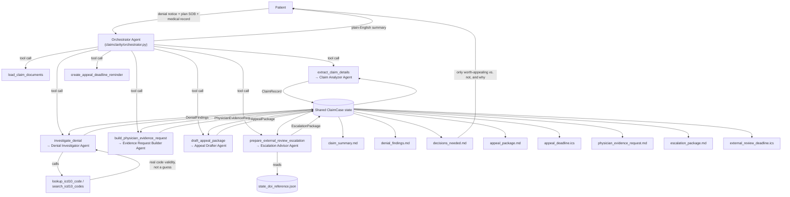

# ClaimClarity

**An agent that reads your health insurance denial, checks it against real ICD-10 coding rules and your plan's own terms, and drafts the appeal — or tells you honestly when it's not worth fighting.**

Built with the [Strands Agents SDK](https://strandsagents.com) for the Agents for Humans Hackathon — **Everyday Agents** track (health & money).

## The problem

A large share of in-network health insurance claims get denied, and most
denials are never appealed — not because they're valid, but because decoding
an Explanation of Benefits (EOB), figuring out whether the denial reason is
even legitimate, and drafting a correctly-argued appeal inside a strict
filing window (often 180 days) is a specialized, exhausting task nobody has
the bandwidth for while sick, injured, or already stressed about a bill. Many
denials are pure mechanical billing errors — an outdated diagnosis code, a
typo — that would be reprocessed immediately if someone just caught it and
said so.

ClaimClarity is that catch. It reads the denial notice, checks the actual
billing codes against real coding rules instead of guessing, cross-references
your plan's own coverage terms, and either drafts a grounded appeal or tells
you plainly that this one isn't worth fighting — so you spend your limited
energy only where it can actually help.

## Who it's for

Anyone who has ever stared at an EOB and had no idea whether the denial was
legitimate. No dedicated billing advocate, no insurance background required.

## What it does, end to end

Given a denial notice/EOB (and, where available, a plan summary of benefits
and a medical record excerpt), ClaimClarity:

1. **Reads** the documents (PDF, DOCX, Markdown, or plain text).
2. **Extracts** a structured claim record: patient, insurer, claim number,
   every denied line item with its procedure/diagnosis codes and denial
   reason (CARC/RARC codes where stated), relevant plan terms, and the appeal
   deadline.
3. **Creates a calendar reminder** (`.ics`) for the appeal deadline, with
   automatic 14-day and 3-day advance reminders.
4. **Investigates each denied line item for real** — this is the part that
   matters: before concluding anything about a diagnosis code, the
   investigating agent actually calls an ICD-10 code lookup tool rather than
   reasoning from a language model's memory of medical coding (a common
   source of confidently wrong billing advice). Every item is classified as a
   `billing_error` (mechanically fixable), `documentation_gap` (needs more
   info from the provider), or `valid_denial` (genuinely excluded — not worth
   appealing) — each with cited evidence, never a guess.
5. **Builds the physician evidence request**: for any denied line item where
   the reason is genuinely about medical necessity — not a coding fix, not a
   flat plan exclusion — ClaimClarity works out the *specific* clinical
   documentation the insurer's own medical necessity criteria would need,
   and drafts a ready-to-send request the patient can hand to their doctor's
   office. See **Physician Letter of Medical Necessity — Evidence Request
   Builder** below.
6. **Drafts the appeal** for everything worth appealing, citing the specific
   denial reason, the corrected code where applicable, and the plan term that
   supports coverage — and writes an honest plain-language explanation for
   anything that isn't worth appealing, instead of drafting a doomed letter
   just to be agreeable.
7. **Prepares the next step almost nobody knows they have**: if the internal
   appeal doesn't fully resolve the denial, most patients have a legal right
   to an independent **External Review** by a third party outside the
   insurer — and, separately, to file a complaint with their state
   **Department of Insurance (DOI)** if the insurer mishandled the claims
   process. ClaimClarity drafts the external review request letter, adds a
   second `.ics` reminder for that (often 4-month) deadline, and — only when
   the investigation actually found a process failure, never reflexively —
   drafts a DOI complaint letter too. See **External Review & Regulatory
   Escalation** below.
8. **Surfaces exactly one decision-ready summary** (`decisions_needed.md`):
   what's worth appealing, what isn't and why, the deadline, and pointers to
   the physician evidence request and the escalation package. Everything
   else runs unattended.

Try it against the included example: a physical therapy claim billed with a
diagnosis code that was deprecated for billing purposes in FY2022 (a real,
common, entirely mechanical cause of denials), bundled alongside a second
line item that's a genuine plan exclusion — so the demo shows the agent
correctly telling the two apart instead of just recommending "appeal
everything." See **Quickstart** below.

## Architecture

Same proven shape as this repo's other entry, BidWright: a Strands
**"agents as tools"** orchestrator, shared state, and validated structured
outputs at every step — applied to a different domain, with one addition
that's specific to this problem: real tool-grounded code validation.



Design choices worth calling out:

- **The investigator has to check, not guess.** The `denial_investigator`
  agent is the one sub-agent given tools (`lookup_icd10_code`,
  `search_icd10_codes`) and is explicitly instructed to call them before
  making any claim about a diagnosis code's validity — see
  `claimclarity/agents/denial_investigator.py`. This is the difference
  between an agent that *sounds* authoritative about medical billing and one
  that actually is, for the specific claims it checks.
- **Grounded on real data, not invented facts.** `claimclarity/data/icd10_reference.json`
  is a small curated subset of the FY2026 ICD-10-CM code set. Every entry was
  verified against an authoritative ICD-10 lookup service during development
  (not generated from a model's memory) — see the file's `_source_note` and
  `claimclarity/tools/icd10.py`'s docstring for how to swap in a live
  ICD-10 API/MCP source for production use covering the full code set.
- **Structured contracts, not free text between agents**, and **the "only
  interrupt for real decisions" file is generated by code, not the model** —
  same discipline as BidWright, for the same reason: `decisions_needed.md`
  comes straight from the validated `DenialFindings`, not the orchestrator's
  retelling of it.
- **Model-provider agnostic** in the same way — `claimclarity/config.py`
  picks Anthropic direct or Amazon Bedrock automatically.
- **The escalation advisor never invents a citation or a deadline.** Like
  the investigator, it's given a bundled reference dataset
  (`claimclarity/data/state_doi_reference.json`) and instructed to draw its
  regulatory basis and deadline window only from that data — see **External
  Review & Regulatory Escalation** below.
- **The evidence request builder only asks for what a denial actually turns
  on.** Like the escalation advisor, it judges from the findings whether
  physician documentation could plausibly change the outcome — a pure
  billing-code fix or a flat plan exclusion gets nothing, honestly, rather
  than a padded request — see **Physician Letter of Medical Necessity —
  Evidence Request Builder** below.

## Physician Letter of Medical Necessity — Evidence Request Builder

**The problem this closes:** "not medically necessary" is the single most
common, most winnable category of health insurance denial — and appeals on
this ground fail constantly not because the treatment wasn't justified, but
because the treating physician's office never submitted the *specific*
clinical documentation the insurer's own medical necessity criteria actually
require (the right diagnosis-to-procedure linkage, prior conservative-
treatment history, specific measurements or scores, and so on). Most winnable
denials are lost on missing paperwork, not on the underlying medical merits.
Patients have no way to know what to ask their doctor's office for, and
doctor's offices are busy and default to sending generic chart notes unless
asked precisely. ClaimClarity already investigates the denial and drafts the
appeal *to the insurer* — this closes the gap upstream of that: the specific
ask *to the physician* for the evidence that appeal actually needs to cite.

ClaimClarity runs this as pipeline step 5, right after the denial
investigation and before the appeal is drafted:

1. The **Evidence Request Builder** agent
   (`claimclarity/agents/evidence_request_builder.py`) reads the actual
   `DenialFindings` and judges, line item by line item, whether the denial is
   genuinely about medical necessity — never a pure billing-code error
   (already being fixed with a corrected code) and never a flat plan
   exclusion (physician evidence can't override an exclusion either way).
   Only qualifying line items get an entry.
2. For each one, it names the *specific* documentation needed (e.g.
   "documented failure of at least 6 weeks of physical therapy prior to
   imaging" — never vague "more documentation"), explains why the insurer
   likely requires it (citing the plan's own stated criteria when
   `relevant_plan_terms` actually contains one, otherwise general
   standard-of-care reasoning clearly labeled as such rather than presented
   as the plan's own language), and gives a short justification the
   physician's office can read and act on in seconds.
3. It drafts a ready-to-send **cover letter to the physician's office**
   listing exactly what's being requested, and a **patient follow-up
   checklist** — what to personally confirm, like whether the office
   received the request and when to follow up if it hasn't responded.
4. Everything is written to `physician_evidence_request.md`.
   `decisions_needed.md` is re-rendered with one line pointing to it.
5. If nothing in the denial actually turns on physician documentation —
   every item is a coding fix or a plan exclusion — the result is honestly
   near-empty rather than padded with a generic request: no items, no cover
   letter, and a `rationale` explaining why.

This is explicitly **not medical advice** — the system prompt says so, and
the agent is held to the same evidence discipline as `denial_investigator.py`
and the escalation advisor: it never invents a diagnosis, test result, or
treatment history that isn't already in the claim record or findings it was
given.

## External Review & Regulatory Escalation

**The problem this closes:** most denied claims that get an internal appeal
never go any further — not because the internal appeal always succeeds, but
because almost nobody knows that after it, US law (the ACA's external review
framework, alongside most state insurance codes) gives them the right to an
**independent External Review** by a third party outside the insurer, and
separately the right to file a complaint with their **state Department of
Insurance (DOI)** if the insurer mishandled the claims process. That right
comes with its own short filing window — often just 4 months from the
internal appeal decision — and almost no patient drafts that request,
because almost no patient is told it exists. This is frequently the more
powerful step: an external reviewer has no relationship with the insurer and
can overturn the denial outright.

ClaimClarity now runs this as pipeline step 7, unconditionally, right after
the internal appeal is drafted:

1. It looks up the patient's state (extracted from the documents where
   possible, `ClaimRecord.state`) against `claimclarity/data/state_doi_reference.json`
   — a bundled sample of 10 states plus a federal-fallback `DEFAULT` entry
   grounded in the genuine, stable ACA baseline (45 CFR 147.136), used
   whenever the state can't be determined or isn't in the sample.
2. The **Escalation Advisor** agent (`claimclarity/agents/escalation_advisor.py`)
   decides, from the actual `DenialFindings`, whether there's still a
   genuine dispute worth escalating (`eligible_for_external_review`), drafts
   a ready-to-send **external review request letter**, and — only when the
   findings show an actual process failure (e.g. a billing error the insurer
   should have caught), never reflexively for a valid denial — drafts a
   **state DOI complaint letter**.
3. Both letters, the deadline window, and a plain-language `regulatory_basis`
   are written to `escalation_package.md`. `decisions_needed.md` is
   re-rendered with one line pointing to it.
4. A second `.ics` reminder, `external_review_deadline.ics`, is created for
   the external review deadline, the same way `appeal_deadline.ics` already
   covers the internal appeal deadline.

This is explicitly **not legal advice** — the escalation advisor's system
prompt says so, and is held to the same evidence discipline as
`denial_investigator.py`: it never states a deadline it wasn't given grounds
for, and it never recommends a DOI complaint as a blanket move — only when
the investigation actually found something the insurer should be held
accountable for.

## Quickstart

```bash
python3 -m venv .venv && source .venv/bin/activate
pip install -e ".[ui]"
cp .env.example .env   # then fill in ANTHROPIC_API_KEY (or configure AWS creds for Bedrock)
```

Run the CLI against the included example claim:

```bash
claimclarity run \
  --document examples/claimclarity/denial_notice.md \
  --document examples/claimclarity/plan_summary_of_benefits.md \
  --document examples/claimclarity/medical_record_excerpt.md \
  --out output
```

This streams each tool call as it happens (including the live ICD-10 lookup
calls), then prints a summary and writes `claim_summary.md`,
`denial_findings.md`, `decisions_needed.md`, `physician_evidence_request.md`,
`appeal_package.md`, `appeal_deadline.ics`, `escalation_package.md`, and
`external_review_deadline.ics` to `output/`.

Or run the Streamlit demo:

```bash
streamlit run app_claimclarity.py
```

Pick the bundled example (or upload your own denial notice, plan summary, and
medical record) and click **Run ClaimClarity** — it shows a live agent
activity log, the decision summary, and downloadable drafts.

Check which model provider will be used at any time with `claimclarity status`.

## Project layout

```
claimclarity/
  models.py                     Pydantic schemas shared between all agents
  config.py                     Model provider selection (Anthropic direct / Bedrock)
  rendering.py                   Deterministic Markdown rendering (no LLM calls)
  data/
    icd10_reference.json         Curated, sourced ICD-10-CM reference subset
    state_doi_reference.json     State DOI complaint / external review reference (10 states + DEFAULT)
  tools/
    documents.py                 @tool read_document, save_text_file
    calendar.py                   @tool create_appeal_deadline_reminder / create_external_review_deadline_reminder
    icd10.py                      @tool lookup_icd10_code, search_icd10_codes
    state_doi.py                  lookup_state_doi_process (+ @tool text-report wrapper)
  agents/
    claim_analyzer.py             Sub-agent: documents -> ClaimRecord
    denial_investigator.py        Sub-agent (tool-using): ClaimRecord -> DenialFindings
    evidence_request_builder.py   Sub-agent: -> PhysicianEvidenceRequest (physician evidence request)
    appeal_drafter.py             Sub-agent: -> AppealPackage
    escalation_advisor.py         Sub-agent: -> EscalationPackage (external review + DOI complaint)
  orchestrator.py                 Orchestrator Agent (agents-as-tools) + shared ClaimCase state
  pipeline.py                     run_claim_case() convenience wrapper used by CLI/UI/AgentCore
  cli.py                          `claimclarity run` / `claimclarity status`
app_claimclarity.py              Demo UI
agentcore_app_claimclarity.py    Optional Bedrock AgentCore Runtime entrypoint
examples/claimclarity/           Sample denial notice + plan summary + medical record excerpt
tests/                           Unit tests (no network) + an opt-in live-model integration test
deploy/                          Dockerfile + AgentCore deployment notes
```

## Testing

```bash
pip install -e ".[dev]"
pytest
```

All unit tests run offline — including against the bundled ICD-10 reference
data directly and orchestrator **wiring tests**
(`tests/test_claimclarity_orchestrator_wiring.py`), which use Strands'
documented `agent.tool.<name>(...)` direct-call interface to drive every
pipeline stage with the sub-agents mocked, and assert the real `ClaimCase`
state transitions, file writes, and error paths are correct — no API key
required for any of it. What this does *not* cover is the orchestrator LLM's
own judgment in choosing tool order, or the quality of what a real model
extracts/classifies/drafts (including whether it actually calls
`lookup_icd10_code` before concluding anything, as instructed) — that needs
an actual model call. A live end-to-end test against a real model is
included but skipped by default; opt in with:

```bash
CLAIMCLARITY_RUN_INTEGRATION=1 pytest tests/test_claimclarity_pipeline_integration.py
```

## Deploying to Amazon Bedrock AgentCore (optional)

`agentcore_app_claimclarity.py` wraps the exact same `run_claim_case`
pipeline behind a `BedrockAgentCoreApp` entrypoint. See
[`deploy/README.md`](deploy/README.md) for the container/CLI steps. This is a
stretch goal, not a requirement — everything above runs standalone.

## Honest limitations

- ClaimClarity drafts; it does not submit. A human always reviews, signs, and
  sends the appeal — that's the point of `decisions_needed.md`.
- The bundled ICD-10 reference data is a small curated demo subset, not the
  full ~70,000-code system — `lookup_icd10_code` says so explicitly for any
  code outside that subset rather than guessing. A production deployment
  should point `claimclarity/tools/icd10.py` at a complete, live ICD-10
  source.
- This is not medical or legal advice, and it does not have access to your
  actual claims history or plan document beyond what you provide — for high-
  stakes or complex denials, a licensed patient advocate or attorney should
  review before you rely on this. ClaimClarity is built to make that review
  fast and well-informed, not to replace it. The External Review & DOI
  escalation feature is held to the same standard: it describes the general
  ACA framework (45 CFR 147.136) and the process for the 10 states in its
  bundled sample generically, and deliberately does not cite exact state
  statute numbers it can't independently verify — see
  `claimclarity/data/state_doi_reference.json`'s `_source_note`. Always check
  your own denial/appeal letter, which is legally required to state your
  plan's actual external review deadline and process.
- The bundled state DOI reference data covers 10 states plus a federal-
  fallback `DEFAULT` entry, not all 50 states + DC — `lookup_state_doi_process`
  falls back to the federal baseline for any other state rather than
  guessing at that state's specific process. A production deployment should
  expand `claimclarity/data/state_doi_reference.json` to full coverage.
- **What's actually been verified, precisely:** the tool functions (including
  ICD-10 and state DOI lookups against the bundled data), Pydantic schemas,
  Markdown rendering, and the orchestrator's tool-call plumbing — including
  the physician evidence request builder's wiring — are covered by 60+
  offline tests and have run clean. The evidence request builder's own
  judgment (which findings actually qualify as medical-necessity-related,
  the quality of a real model's drafted letter) has *not* been checked
  against a live model — only its offline wiring has, the same limitation
  the wiring tests below call out for every other step.
  `test_claimclarity_pipeline_integration.py` has also passed against a real
  model end to end for the original pipeline, correctly calling
  `lookup_icd10_code` before judging a code and correctly classifying both
  the fixable billing error and the genuine plan exclusion in the bundled
  example. A live run also surfaced a real bug worth knowing about: the
  orchestrator's own free-text reply (not the generated files, which were
  correctly grounded every time) once fabricated an entirely different claim
  scenario - its tool results intentionally carry only counts and filenames,
  not full detail, but its prompt was asking it to enumerate specifics
  anyway. Fixed by having it defer to `decisions_needed.md` instead of
  reconstructing details from memory, and by making the CLI/UI show that
  deterministic file as the trusted headline, with the orchestrator's own
  reply demoted to a clearly-labeled, informational-only view. If you change
  the orchestrator prompt, re-run
  `CLAIMCLARITY_RUN_INTEGRATION=1 pytest tests/test_claimclarity_pipeline_integration.py`
  with a working `ANTHROPIC_API_KEY` or Bedrock access rather than assuming
  a prompt edit is safe.
