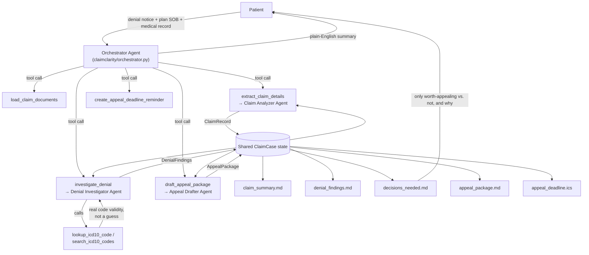

# ClaimClarity

**An agent that reads your health insurance denial, checks it against real ICD-10 coding rules and your plan's own terms, and drafts the appeal — or tells you honestly when it's not worth fighting.**

Built with the [Strands Agents SDK](https://strandsagents.com) for the Agents for Humans Hackathon — **Everyday Agents** track (health & money).

## The problem

A large share of in-network health insurance claims get denied, and most
denials are never appealed — not because they're valid, but because decoding
an Explanation of Benefits (EOB), figuring out whether the denial reason is
even legitimate, and drafting a correctly-argued appeal inside a strict
filing window (often 180 days) is a specialized, exhausting task nobody has
the bandwidth for while sick, injured, or already stressed about a bill. Many
denials are pure mechanical billing errors — an outdated diagnosis code, a
typo — that would be reprocessed immediately if someone just caught it and
said so.

ClaimClarity is that catch. It reads the denial notice, checks the actual
billing codes against real coding rules instead of guessing, cross-references
your plan's own coverage terms, and either drafts a grounded appeal or tells
you plainly that this one isn't worth fighting — so you spend your limited
energy only where it can actually help.

## Who it's for

Anyone who has ever stared at an EOB and had no idea whether the denial was
legitimate. No dedicated billing advocate, no insurance background required.

## What it does, end to end

Given a denial notice/EOB (and, where available, a plan summary of benefits
and a medical record excerpt), ClaimClarity:

1. **Reads** the documents (PDF, DOCX, Markdown, or plain text).
2. **Extracts** a structured claim record: patient, insurer, claim number,
   every denied line item with its procedure/diagnosis codes and denial
   reason (CARC/RARC codes where stated), relevant plan terms, and the appeal
   deadline.
3. **Creates a calendar reminder** (`.ics`) for the appeal deadline, with
   automatic 14-day and 3-day advance reminders.
4. **Investigates each denied line item for real** — this is the part that
   matters: before concluding anything about a diagnosis code, the
   investigating agent actually calls an ICD-10 code lookup tool rather than
   reasoning from a language model's memory of medical coding (a common
   source of confidently wrong billing advice). Every item is classified as a
   `billing_error` (mechanically fixable), `documentation_gap` (needs more
   info from the provider), or `valid_denial` (genuinely excluded — not worth
   appealing) — each with cited evidence, never a guess.
5. **Drafts the appeal** for everything worth appealing, citing the specific
   denial reason, the corrected code where applicable, and the plan term that
   supports coverage — and writes an honest plain-language explanation for
   anything that isn't worth appealing, instead of drafting a doomed letter
   just to be agreeable.
6. **Surfaces exactly one decision-ready summary** (`decisions_needed.md`):
   what's worth appealing, what isn't and why, and the deadline. Everything
   else runs unattended.

Try it against the included example: a physical therapy claim billed with a
diagnosis code that was deprecated for billing purposes in FY2022 (a real,
common, entirely mechanical cause of denials), bundled alongside a second
line item that's a genuine plan exclusion — so the demo shows the agent
correctly telling the two apart instead of just recommending "appeal
everything." See **Quickstart** below.

## Architecture

Same proven shape as this repo's other entry, BidWright: a Strands
**"agents as tools"** orchestrator, shared state, and validated structured
outputs at every step — applied to a different domain, with one addition
that's specific to this problem: real tool-grounded code validation.



Design choices worth calling out:

- **The investigator has to check, not guess.** The `denial_investigator`
  agent is the one sub-agent given tools (`lookup_icd10_code`,
  `search_icd10_codes`) and is explicitly instructed to call them before
  making any claim about a diagnosis code's validity — see
  `claimclarity/agents/denial_investigator.py`. This is the difference
  between an agent that *sounds* authoritative about medical billing and one
  that actually is, for the specific claims it checks.
- **Grounded on real data, not invented facts.** `claimclarity/data/icd10_reference.json`
  is a small curated subset of the FY2026 ICD-10-CM code set. Every entry was
  verified against an authoritative ICD-10 lookup service during development
  (not generated from a model's memory) — see the file's `_source_note` and
  `claimclarity/tools/icd10.py`'s docstring for how to swap in a live
  ICD-10 API/MCP source for production use covering the full code set.
- **Structured contracts, not free text between agents**, and **the "only
  interrupt for real decisions" file is generated by code, not the model** —
  same discipline as BidWright, for the same reason: `decisions_needed.md`
  comes straight from the validated `DenialFindings`, not the orchestrator's
  retelling of it.
- **Model-provider agnostic** in the same way — `claimclarity/config.py`
  picks Anthropic direct or Amazon Bedrock automatically.

## Quickstart

```bash
python3 -m venv .venv && source .venv/bin/activate
pip install -e ".[ui]"
cp .env.example .env   # then fill in ANTHROPIC_API_KEY (or configure AWS creds for Bedrock)
```

Run the CLI against the included example claim:

```bash
claimclarity run \
  --document examples/claimclarity/denial_notice.md \
  --document examples/claimclarity/plan_summary_of_benefits.md \
  --document examples/claimclarity/medical_record_excerpt.md \
  --out output
```

This streams each tool call as it happens (including the live ICD-10 lookup
calls), then prints a summary and writes `claim_summary.md`,
`denial_findings.md`, `decisions_needed.md`, `appeal_package.md`, and
`appeal_deadline.ics` to `output/`.

Or run the Streamlit demo:

```bash
streamlit run app_claimclarity.py
```

Pick the bundled example (or upload your own denial notice, plan summary, and
medical record) and click **Run ClaimClarity** — it shows a live agent
activity log, the decision summary, and downloadable drafts.

Check which model provider will be used at any time with `claimclarity status`.

## Project layout

```
claimclarity/
  models.py                     Pydantic schemas shared between all agents
  config.py                     Model provider selection (Anthropic direct / Bedrock)
  rendering.py                   Deterministic Markdown rendering (no LLM calls)
  data/
    icd10_reference.json         Curated, sourced ICD-10-CM reference subset
  tools/
    documents.py                 @tool read_document, save_text_file
    calendar.py                   @tool create_appeal_deadline_reminder (.ics generation)
    icd10.py                      @tool lookup_icd10_code, search_icd10_codes
  agents/
    claim_analyzer.py             Sub-agent: documents -> ClaimRecord
    denial_investigator.py        Sub-agent (tool-using): ClaimRecord -> DenialFindings
    appeal_drafter.py             Sub-agent: -> AppealPackage
  orchestrator.py                 Orchestrator Agent (agents-as-tools) + shared ClaimCase state
  pipeline.py                     run_claim_case() convenience wrapper used by CLI/UI/AgentCore
  cli.py                          `claimclarity run` / `claimclarity status`
app_claimclarity.py              Demo UI
agentcore_app_claimclarity.py    Optional Bedrock AgentCore Runtime entrypoint
examples/claimclarity/           Sample denial notice + plan summary + medical record excerpt
tests/                           Unit tests (no network) + an opt-in live-model integration test
deploy/                          Dockerfile + AgentCore deployment notes
```

## Testing

```bash
pip install -e ".[dev]"
pytest
```

All unit tests run offline — including against the bundled ICD-10 reference
data directly, no API key required. A live end-to-end test against a real
model is included but skipped by default; opt in with:

```bash
CLAIMCLARITY_RUN_INTEGRATION=1 pytest tests/test_claimclarity_pipeline_integration.py
```

## Deploying to Amazon Bedrock AgentCore (optional)

`agentcore_app_claimclarity.py` wraps the exact same `run_claim_case`
pipeline behind a `BedrockAgentCoreApp` entrypoint. See
[`deploy/README.md`](deploy/README.md) for the container/CLI steps. This is a
stretch goal, not a requirement — everything above runs standalone.

## Honest limitations

- ClaimClarity drafts; it does not submit. A human always reviews, signs, and
  sends the appeal — that's the point of `decisions_needed.md`.
- The bundled ICD-10 reference data is a small curated demo subset, not the
  full ~70,000-code system — `lookup_icd10_code` says so explicitly for any
  code outside that subset rather than guessing. A production deployment
  should point `claimclarity/tools/icd10.py` at a complete, live ICD-10
  source.
- This is not medical or legal advice, and it does not have access to your
  actual claims history or plan document beyond what you provide — for high-
  stakes or complex denials, a licensed patient advocate or attorney should
  review before you rely on this. ClaimClarity is built to make that review
  fast and well-informed, not to replace it.
