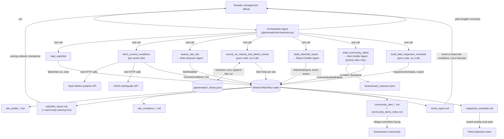

# GlacierWatch

**Combines published, cited Himalayan glacial-hazard assessments with live weather and seismic data to prioritize monitoring attention — never a prediction of if, when, or where an avalanche or glacial lake outburst flood (GLOF) will occur.**

Built with the [Strands Agents SDK](https://strandsagents.com) for the Agents for Humans Hackathon — **Good Neighbor Agents** track.

## Why this, and why framed this way

On August 26, 2026, a glacier collapse and debris flow on the Nepal-Tibet border killed over 600 people, with thousands still missing — an event so violent it registered on seismographs as a magnitude-4.4 equivalent. It wasn't predicted. India has had the same kind of event twice already: [Chamoli, Uttarakhand (2021)](https://en.wikipedia.org/wiki/2021_Uttarakhand_flood) and [South Lhonak Lake, Sikkim (2023)](https://www.downtoearth.org.in/climate-change/the-2023-sikkim-disaster-exposes-growing-risk-of-glofs-in-a-warming-himalaya), which killed 42 and left 70+ missing despite the lake having been formally flagged as dangerous since 2019.

A tool that claims to predict the next one would be dishonest, and worse, could give someone false confidence not to evacuate. What's real and useful is narrower: India's National Disaster Management Authority tracks 56 glacial lakes nationally for monitoring, out of [28,043 glacial lakes ≥0.25 hectares](https://www.downtoearth.org.in/climate-change/the-2023-sikkim-disaster-exposes-growing-risk-of-glofs-in-a-warming-himalaya) catalogued across the Indian Himalayan Region — nobody can instrument all of them, so risk has to be triaged. GlacierWatch is exactly that triage step, automated: combine what's already published and documented about a site with this week's real, observed conditions, and flag which sites deserve a look right now.

## Who it's for

State disaster management authorities, and village-level disaster committees in Himalayan districts, who need to decide where to point limited field-inspection and monitoring resources this week — not a replacement for the glaciologists and geotechnical engineers who make the actual call.

## What it does, end to end

1. **Loads** a small, cited reference watchlist of documented Himalayan glacial hazard sites (see [Honest limitations](#honest-limitations) on why this list is small).
2. **Fetches live conditions** for every active site from real, public APIs: daily precipitation from [Open-Meteo](https://open-meteo.com), categorized on India Meteorological Department's official rainfall scale, and recent nearby seismic activity from the [USGS earthquake catalog](https://earthquake.usgs.gov).
3. **Assesses each site**: combines the site's documented, cited risk profile with this week's real conditions into a `priority` / `elevated` / `routine` classification, grounded only in the specific facts provided — never invented detail, and never predicting an event.
4. **Records this run's history and detects trends**: appends this week's key numeric signals to a small persistent history file and classifies each site's trajectory (`rising` / `flat` / `falling` / `insufficient_history`) against prior runs, by plain code, never an LLM judgment - see [Run History & Trend Early-Warning Tracker](#run-history--trend-early-warning-tracker) below.
5. **Drafts a weekly watchlist report**, prominently disclaimed as decision support, listing which sites need attention this week and the specific, concrete action recommended for each, plus a one-line trend early-warning note for any site trending upward that isn't yet at priority level.

Run it against the bundled reference sites — two currently-monitored lakes (Gepang Gath and Samudra Tapu, both in Himachal Pradesh's Lahaul-Spiti, both formally assessed by India's National Remote Sensing Centre) and two historical case studies (South Lhonak, Sikkim and Chorabari, Uttarakhand) used to ground the tool's rainfall-trigger threshold in a real, documented failure. See **Quickstart** below.

## Downstream Exposure & Community Alert Bulletins

`watchlist_report.md` is written for officials who already know what a moraine dam or an "extremely heavy rainfall" flag means. It says nothing about who is actually downstream of a flagged site, or how to tell them - which is exactly the gap that turned a formally-identified, monitored hazard into 42 deaths at South Lhonak in 2023: the lake was known, but the early-warning system that was supposed to reach people downstream lost power at the critical moment. Good triage that never reaches a village committee doesn't save anyone. This feature is the pipeline's fifth step, closing that gap:

6. **Drafts a Community Alert Bulletin** for every site assessed at `priority` level this week (only priority sites - `elevated` and `routine` sites don't get one), written in plain language for a village-level committee rather than officials, listing the specific downstream settlements potentially exposed, concrete actions the committee itself can take (never an evacuation order - that's not this tool's authority), and a short public-notice text in English plus, where a confident translation is possible, in the local language (Hindi or Nepali, Devanagari script).

This draws on a new bundled reference file, `glacierwatch/data/downstream_exposure.json`, listing plausible downstream settlements per site with approximate distance and a coarse population-exposure *band* (e.g. "small hamlet <500") - deliberately never a precise headcount. **Be clear-eyed about this file's authority: unlike `watchlist.json`, most of its settlement/population entries are illustrative placeholders for this demo, not verified data**, and its `data_caveat` field says so explicitly. The one exception is Sissu village near Gepang Gath Lake, whose exposure (reachable in ~21 minutes of a breach) is directly sourced to the same NRSC/press modeling cited in `watchlist.json`. A real deployment of this feature must replace the illustrative entries with verified settlement and population data from the relevant state disaster management authority and national census - never hand a village committee a bulletin built on invented population figures.

Every bulletin carries the same non-prediction disclaimer as the rest of this project, and the drafting sub-agent (`glacierwatch/agents/alert_drafter.py`) is instructed, same as `risk_assessor.py`, to use only the data it's given - never inventing a settlement, a distance, or a population figure, and never claiming a flood or avalanche "will" happen. If a site's downstream exposure isn't documented yet, the bulletin says so plainly instead of guessing.

Outputs: `community_alert_<site_id>.md` per priority site, plus `community_alerts_index.md` listing which sites got one this week (or, when zero sites are at priority level, a clear "no alerts drafted" note - the pipeline never writes empty per-site files).

## Run History & Trend Early-Warning Tracker

Every step above, including the two features already described, makes exactly one judgment: what does *this week's* triage look like, from *this week's* conditions alone? That's a real gap. A site whose recent-day rainfall and nearby seismic activity have been climbing for three consecutive weekly runs is a meaningfully different situation from a site with the same absolute readings today but a flat or declining trend - even when neither has crossed the `priority` threshold this week. Disaster-management triage benefits enormously from catching an escalating trajectory *before* any single week's snapshot alone would trigger it. Nothing described above persists data across runs to make that possible, so this feature adds exactly that memory:

- **After every site is assessed**, `record_run_history_and_detect_trends` appends this run's key numeric signals per active_watch site - `site_id`, run timestamp, `max_daily_precipitation_mm`, `nearby_seismic_events` count, and `priority_level` - to a small, persistent, plain-JSON history file (`glacierwatch/tools/history.py`, `RunHistory`/`HistoryEntry` in `glacierwatch/models.py`). A missing file simply means this is the first run - not an error - and a malformed or empty file fails gracefully back to a fresh, empty history rather than taking down the rest of the pipeline.
- **Trend classification is pure code, not an LLM call** - a numeric comparison across 2-4 stored runs is exactly the kind of thing that should be deterministic, not judged by a model. `classify_trend` (fully documented in its own docstring in `glacierwatch/tools/history.py`) compares the run-over-run deltas in precipitation and seismic-event count across a site's most recent stored runs: `rising` requires every consecutive delta on both signals to be non-decreasing with at least one strict increase somewhere in the window; `falling` is the mirror image; anything else - including genuinely flat readings and mixed signals like rain climbing while seismic activity falls - is conservatively `flat`. A site with fewer than 2 prior runs recorded is honestly reported as `insufficient_history`, never guessed at.
- **The result reaches the report an official actually reads, not just a file nobody opens.** `watchlist_report.md` itself gets one deterministic early-warning line - "N site(s) show a rising trend across recent runs but are not yet at priority level this week - recommend closer monitoring" - whenever that's true, alongside the full per-site detail in a new `trend_report.md`, always written regardless of whether anything is trending, so a reader can tell "checked, nothing rising" apart from "this step didn't run."
- **`--history-file PATH`** controls where this file lives (default: `./glacierwatch_history.json`), threaded through `glacierwatch/pipeline.py`'s `run_watchlist(history_file=...)` into the orchestrator's `WatchRun`. It's deliberately independent of `--out` by default, since it needs to keep accumulating across runs even when `--out` changes week to week; point every run at the same `--history-file` to build up trend history, or a fresh path to start over.

Honest limitations specific to this feature: it takes at least three recorded runs of the same site before a trend is anything but `insufficient_history` - a brand-new deployment, or a site just added to the watchlist, will show `insufficient_history` for weeks by design, not as a bug. And a `rising` trend describes already-observed conditions climbing run over run; it is not a forecast, does not mean an avalanche or GLOF is more likely, and a `flat` or `falling` classification does not mean a site is safe - every rendered file, including `trend_report.md`, says this explicitly.

## Field Inspection Scheduler

Everything above answers "which sites need attention this week" - correctly. What none of it answers is what a disaster-management field team actually does with that list on Monday morning. A real field team has limited capacity: it can only physically visit a handful of sites in a week, those sites are scattered across a mountainous region with real travel-time constraints, and a priority ranking on its own doesn't say which sites fit in a week or in what order to drive to them. Risk triage that never becomes an actual field team work plan is priority ranking, not decision support - this is the pipeline's seventh step, closing that specific gap:

7. **Builds a field inspection schedule**: selects this week's `active_watch` sites at `priority` level first, then `elevated`, then (as a lower-priority bonus tier, capacity allowing) any `routine` site the trend tracker flagged as `rising` but not yet at priority level - a plain `routine`, non-trending site is never scheduled just to fill a spare slot, since a field team's limited time is better spent than confirming nothing is happening where nothing indicates anything is happening. `historical_case_study` sites (South Lhonak, Chorabari) are never candidates - they're reference cases for calibrating this tool, not places with anything left to inspect. The candidate list is capped at `--max-field-stops` (default 5, threaded through `glacierwatch/pipeline.py`'s `run_watchlist(max_field_stops=...)` into the orchestrator's `WatchRun`), dropping the lowest-priority overflow rather than crashing or silently scheduling more than capacity allows.

**Visiting order is computed, not just priority-sorted.** `glacierwatch/tools/scheduler.py:build_inspection_schedule` orders the selected stops with a greedy nearest-neighbor route: start at the highest-priority selected site, then repeatedly jump to whichever unvisited stop is closest (haversine great-circle distance between lat/long points) until every stop is routed. **This is pure code, not an LLM call** - like trend classification, ordering a handful of stops by distance is a geometric/logistics optimization over structured numbers, exactly what this project's architecture already treats as plain code's job (see [Run History & Trend Early-Warning Tracker](#run-history--trend-early-warning-tracker) above).

Outputs: `inspection_schedule.md` - an ordered stop list a field team lead can literally follow, each stop carrying its priority level, coordinates, and the same `SiteRiskBrief.rationale` an official reading `watchlist_report.md` would see for that site. Always written, even when zero sites qualify this week, with a clear "no inspection schedule was built" message rather than an error or a missing file - same convention as `community_alerts_index.md`'s zero-priority case.

Honest limitation specific to this feature, stated in the rendered file itself: the route is a greedy nearest-neighbor heuristic, not a true Traveling Salesman Problem solve - finding the actual shortest route is NP-hard in general, and greedy nearest-neighbor can occasionally strand one far-away stop for last when visiting it earlier would have shortened the total trip. For the small number of stops a weekly capacity limit implies, that's an acceptable, instantly-computed tradeoff, but it is illustrative sequencing only. More importantly, haversine distance is straight-line ("as the crow flies") distance, not road distance - actual travel time along mountain switchback roads can be far longer than a straight-line number suggests, and the tool has no access to real road networks or conditions. The suggested order is a starting point, always subject to the field team's own local road knowledge, never a routing mandate.

## Architecture

Same proven shape as this repo's other two entries: a Strands **"agents as tools"** orchestrator, validated Pydantic structured outputs at every step, and a deterministic, code-rendered report as the trusted output.



Design choices worth calling out:

- **Two distinct kinds of data, kept visibly separate in the schema.** `WatchSite` is static, published, cited fact (never changes); `CurrentConditions` is live data pulled from real APIs at run time. `SiteRiskBrief` is the only place they combine, and only to prioritize attention.
- **The judgment agent gets full structured data, not a summary.** `risk_assessor` receives the complete `WatchSite` and `CurrentConditions` JSON in its own prompt - a lesson learned the hard way building this repo's other two agents, where sub-agents given only terse tool-result summaries would occasionally fabricate plausible-sounding specifics they were never actually given. See `BIDWRIGHT.md`'s and `CLAIMCLARITY.md`'s Honest Limitations sections for that story.
- **The trusted output is generated by code, not the model.** `watchlist_report.md` is built deterministically from validated `SiteRiskBrief` objects in `glacierwatch/rendering.py`, always ordered priority-first, always carrying the full non-prediction disclaimer. The orchestrator's own free-text reply is instructed to point at this file rather than reconstruct specifics from memory, and both the CLI and the Streamlit UI show the deterministic report as the headline, with the model's own reply demoted to a clearly labeled, informational-only view.
- **Real APIs, real error handling.** `fetch_precipitation` and `fetch_seismic_events` make live HTTP calls with a short retry for transient network failures, but never substitute fabricated data for a real failure - a failed fetch returns an honest error, visible in the tool result, not a silently-guessed number.
- **Model-provider agnostic**, in the same way as the other two projects — `glacierwatch/config.py` picks Anthropic direct or Amazon Bedrock automatically.

## Quickstart

```bash
python3 -m venv .venv && source .venv/bin/activate
pip install -e ".[ui]"
cp .env.example .env   # then fill in ANTHROPIC_API_KEY (or configure AWS creds for Bedrock)
```

Run the CLI:

```bash
glacierwatch run --out output
```

This streams each tool call as it happens (including the live weather/seismic API calls), then prints the deterministic weekly watchlist report, followed by the orchestrator's own summary, and writes `site_profile_*.md`, `site_conditions_*.md`, `watchlist_report.md`, `trend_report.md`, `inspection_schedule.md`, and (for any priority-level sites) `community_alert_*.md` plus `community_alerts_index.md` to `output/`. It also appends this run's signals to `./glacierwatch_history.json` (override with `--history-file`) - run it again next week against the same history file to start seeing trend classifications instead of `insufficient_history`. Use `--max-field-stops N` (default 5) to change how many sites the field inspection scheduler selects for the week.

Or run the Streamlit demo:

```bash
streamlit run app_glacierwatch.py
```

Click **Run GlacierWatch** — it shows a live agent activity log, the weekly watchlist, per-site profiles and current conditions, and a download button for the report.

Check which model provider will be used at any time with `glacierwatch status`.

## Project layout

```
glacierwatch/
  models.py                    Pydantic schemas - WatchSite (static/cited) vs
                                CurrentConditions (live) kept explicitly separate
  config.py                    Model provider selection (Anthropic direct / Bedrock)
  rendering.py                  Deterministic Markdown rendering (no LLM calls)
  data/
    watchlist.json               Bundled reference sites - every claim cited
    downstream_exposure.json     Bundled downstream settlements - illustrative, see data_caveat field
  tools/
    documents.py                 @tool save_text_file
    weather.py                   Live precipitation via Open-Meteo + IMD categorization
    seismic.py                   Live seismic activity via USGS earthquake catalog
    watchlist.py                 Loads the bundled reference data
    downstream.py                 Loads the bundled downstream-exposure data
    history.py                    Pure-code run-history load/append/save + trend classification
    scheduler.py                  Pure-code field inspection route builder (haversine + nearest-neighbor)
    _http.py                      Shared retry helper for the two live API calls
  agents/
    risk_assessor.py              Sub-agent: WatchSite + CurrentConditions -> SiteRiskBrief
    report_drafter.py             Sub-agent: -> WatchlistReport
    alert_drafter.py              Sub-agent: SiteRiskBrief + settlements -> CommunityAlertBulletin
  orchestrator.py                 Orchestrator Agent (agents-as-tools) + shared WatchRun state
  pipeline.py                     run_watchlist() convenience wrapper used by CLI/UI
  cli.py                          `glacierwatch run` / `glacierwatch status`
app_glacierwatch.py              Demo UI
tests/                           Unit tests (mocked HTTP, no network) + an opt-in live-model integration test
```

## Testing

```bash
pip install -e ".[dev]"
pytest
```

All unit tests run offline - HTTP calls to Open-Meteo and USGS are mocked with fixtures shaped exactly like real captured responses, so parsing/categorization/error-handling logic is verified without network access. Orchestrator wiring tests use Strands' `agent.tool.<name>(...)` direct-call interface with the sub-agents mocked, same discipline as the other two projects. A live end-to-end test against real APIs and a real model is included but skipped by default; opt in with:

```bash
GLACIERWATCH_RUN_INTEGRATION=1 pytest tests/test_glacierwatch_pipeline_integration.py
```

## Honest limitations

- **This is a triage tool, not a forecasting system, full stop.** It cannot and does not claim to predict whether, when, or where an avalanche or GLOF will occur. Every generated report carries this disclaimer prominently; treat any output as a starting point for expert review, never as an operational decision on its own.
- **The bundled watchlist is small and illustrative, not comprehensive.** Four sites, chosen because each has genuinely citable, published data (NRSC risk assessments, peer-reviewed growth measurements, documented historical failures) - not because they're the most dangerous sites in India. Expanding this to the real 56-lake NDMA monitoring list or the full 28,043-lake NRSC inventory requires that data in a machine-readable form, which is not fully public as of this writing. `glacierwatch/tools/watchlist.py`'s docstring says how to swap in a fuller source.
- **The rainfall trigger threshold is a reasonable proxy, not a validated model.** It's set at IMD's official "extremely heavy rainfall" category (>204.4mm/24h), the same order of magnitude as the documented trigger in the 2013 Chorabari Lake failure (>315mm combined with rapid glacier melt) - but real GLOF/avalanche triggering involves glacier dynamics, permafrost, and slope mechanics this tool has no access to. A quiet week of rainfall does not mean a site is safe.
- **What's actually been verified, precisely:** every HTTP-calling tool function, the IMD rainfall categorization, the distance calculation, the rendering, and the orchestrator's tool-call plumbing are covered by offline tests using response fixtures shaped identically to real captured API responses. The full pipeline has also been run against the real Open-Meteo and USGS APIs directly during development (not just mocked). Whether the orchestrator LLM reliably sequences all tool calls unprompted, and the quality of its risk judgments with a real model in the loop, depends on model access this development environment did not always have reliably - run `GLACIERWATCH_RUN_INTEGRATION=1 pytest tests/test_glacierwatch_pipeline_integration.py` yourself before treating a specific model/prompt combination as demo-proven.
- **Every fact in `glacierwatch/data/watchlist.json` is sourced** to specific published reporting (NRSC assessments, peer-reviewed papers, established news coverage) - see the `sources` field on each entry. Nothing there is estimated or invented.
- **`glacierwatch/data/downstream_exposure.json` is explicitly the opposite of that:** demo-grade and mostly illustrative, not verified. Its `data_caveat` field says so, and most individual entries are marked "illustrative, unverified" rather than sourced. The one settlement backed by the same real published modeling as `watchlist.json` is Sissu village near Gepang Gath Lake. Before any real village committee acts on a `community_alert_*.md` bulletin, this file must be replaced with verified settlement and population data from the relevant state disaster management authority and national census - shipping placeholder population figures to a real community would be a serious harm this project takes seriously enough to flag loudly here, not just in the JSON comment.
- **Trend detection needs a real run history to say anything.** A fresh `--history-file`, or a site newly added to the watchlist, reports `insufficient_history` for its first two runs by design - that is an honest "not enough data yet," not a bug or a hidden "nothing to worry about." And a `rising` classification describes already-observed numbers climbing run over run; it is not a forecast, it does not mean an avalanche or GLOF is more likely, and `flat`/`falling` does not mean a site is safe. See [Run History & Trend Early-Warning Tracker](#run-history--trend-early-warning-tracker) above.
- **The field inspection route is a greedy nearest-neighbor heuristic, not an optimal route, and its distances are illustrative sequencing only.** `glacierwatch/tools/scheduler.py` orders stops by straight-line (haversine) distance between lat/long points - it has no access to actual mountain road networks, road conditions, seasonal closures, or real travel time, all of which can make the true driving order and duration very different from what the straight-line distance suggests. It is also not a true Traveling Salesman Problem solve, so even by straight-line distance it is not guaranteed to be the shortest possible route. `inspection_schedule.md` says this explicitly, and the suggested order is always subject to the field team's own local road knowledge, never a routing mandate. See [Field Inspection Scheduler](#field-inspection-scheduler) above.
